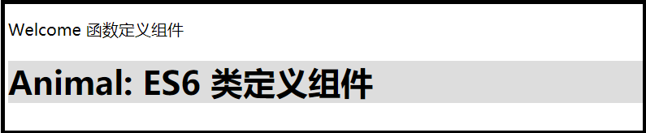

[TOC]


------


[React中文教程](https://react.docschina.org/docs/hello-world.html)

### 库

> react.js 是React的核心库
>
> react-dom.js 提供了与DOM相关的功能
>
> Browser.js 提供JSX的转码功能
>
> ```shell
> babel src --out-dir build; // 将 src下js文件转码，输出到build文件夹下
> ```

> 通过 <script>加载React，将作用于全局。 

### Hello world

> ReactDom.render() 将模板转为HTML语言，并插入指定的DOM节点。原先节点中有内容会被覆盖！

```jsx
ReactDom.render(
    <div>
        <h1>Hello World!</h1>
    </div>,
    document.querySelector("root")
);
```

建议先了解ES6中：

[箭头函数](https://developer.mozilla.org/en-US/docs/Web/JavaScript/Reference/Functions/Arrow_functions)， [类](https://developer.mozilla.org/en-US/docs/Web/JavaScript/Reference/Classes)， [模板字符串](https://developer.mozilla.org/en/docs/Web/JavaScript/Reference/Template_literals)， [`let`](https://developer.mozilla.org/en-US/docs/Web/JavaScript/Reference/Statements/let)， 和 [`const`](https://developer.mozilla.org/en-US/docs/Web/JavaScript/Reference/Statements/const) 声明 

### JSX简介

> jsx是javascript的扩展语言，在React中推荐使用，看起来比较像模板语言。
>
> 参数使用小驼峰命名，className...
>
> 解析规则：
>
> - 遇到 “<” ，用HTML解析
>   - 大写开头：组件
>   - 小写开头：内置元素
> - 遇到 “ { ”，用 javaScript解析

```jsx
const user = {
    firstName: "Jone",
    lastName:  "Snow"
};

const element = <h1>Hello, 阿肆！</h1>;
const userElement = (
    <div>Hello, {user.firstName} {user.lastName}</div>
);
```

> Basel编译器会把 JSX 编译成 
>
> React.createElement( component , props ,  ...children ) 的方法调用。

```jsx
// JSX
const element = (
    <div className="react-item">react对象</div>
);

// Babel编译结果
React.createElement(
    'div',
    {className: 'react-item'},
    'react 对象'
);
```

### react元素

> 元素是构成react的最小单位，用来描述你在屏幕上看到的最小单位。React当中的元素事实上是普通的对象，React DOM可以确保浏览器DOM 的数据与React元素保持一致。

```jsx
// 方法二将返回如下类似的“react元素”，react通过读取这些对象来构建DOM并保持数据一致；
const element = {
    type: 'div',
    props: {
        className: 'react-item',
        children: 'react对象'
    }
}；
```

> 在页面上定义react 根节点 “ \<div class="root"\>\</div\> ”，然后通过“ ReactDOM.render( reactElement，根节点Dom元素) ”将其渲染到页面上。

- react元素都是immutable不可变的。
- react只会更新必要的部分。

### 组件 & Props

> 组件化开发思想，将UI切分成一些独立可复用的组件，再组装起来。
>
> **组件名字必须大写！且有结束标识 \< Welcome  /\>**
>
> **组件的返回值中只能有一个根组件，所以必须用div标签包裹多个子元素**

- 组件输入：props

  - 可以直接赋值：字符串

  - 写了属性不赋值：默认为 “true”，不建议！与JS对象简写混淆：{foo:foo}，{foo}

  - 扩展属性

    ```jsx
    const props = {firstName:"ben" lastName:"Hector"};
    function App1(){  return <Greeting firstName="ben" lastName="Hector" />;  }
    function App2(){  return <Greeting {...props} />;  }
    ```

  - props.children;  组件标签内的元素

- 组件输出：React元素

  - return 可以是一个组件

  - 可以是一个数组，但别忘记 key 值

    ​	[	<li key="0">0\<li\>

    ​		<li key="1">1\<li\> 	]	

```jsx
// 函数定义组件
function Welcome(props){
  return (<div>Welcome {props.name}</div>);
}
ReactDOM.render(
  <Welcome name="函数定义组件" />,
  document.getElementById("root2")
);

// ES6 类定义组件
class Animal extends React.Component{
  render(){
    return (
        <h1 className="root4">
            Animal: {this.props.name}    <!--注意参数传入方式-->
        </h1>
    );
  }
}

ReactDOM.render(
  <Animal name="ES6 类定义组件" />,  // 组件使用
  document.getElementById("root3")
);
```



```jsx
// 组件套用
function SaySomething(props){
    return (
        <div>SaySomething
            <Welcome name="组件套用" />
        </div>
    );
}
```

```jsx
<Component params="传入的数据" />   // 字符串常量
<Component params={"传入的数据"} /> // 等价
```

### React.PropTypes 数据类型检查

> 自React v15.5起已经弃用，请用prop-types库代替。
>
> 出于性能原因，propTypes只在开发模式下进行检查。
>
> ```jsx
> import PropTypes from 'prop-types';
> class Greeting extends React.Component{
>     constructor(){ super(props); }
>     render(){
>         return (<h1>{this.props.name}</h1>);
>     }
> }
> Greeting.propTypes = {
>     name: PropTypes.string
> };  
> ```

### 静态类型检查

> TypeScript 
>
> Flow

### Refs & DOM


### State & 生命周期

> 现阶段学习中，我们通过 ReactDOM.render( ) 来更新UI。

- 定义为类的组件有一些特性。局部状态即是如此，只适用于类。

```jsx
// 通过状态来刷新时间
class Clock extends React.Component{
     // 构造函数
    constructor(props){    
        super(props);
        this.state = { data: new Date() };  // 初始化状态
    }
    
    render(){
        return (<h1>{ this.state.date.toLocaleString() }</h1>);
    }
    
    // 组件挂载好以后执行
    componentDidMount(){     
        this.timerId = setInterval( ()=> this.tick(),1000);
    }
    
    // this.setState() 设置状态，只能通过此方法改变
    tick(){             
        this.setState( { data:new Date() } );
    }
    
    // 组件即将销毁时清除定时器
    componentWillUnmount(){   
        clearInterval(this.timerId);
    }
}

ReactDOM.render(<Clock />, document.querySelector("#timer"));
```

> **知识点** state
>
> - 构造函数是唯一能初始化 state 的地方
> - state 中通过 setState 设置的属性能进行浅合并，单独设置不会导致另一项失效。
> - prevState中包含未改变时的state

```jsx
constructor(){
    super(props);
    this.state = {
        posts:[],
        comments: [],
        isToggle: true,
    };
}
// 浅合并
getData(){
    this.setState({ posts: [1,2,3]});
    this.setState({comments: [99,99]});
}

changeToggle(){ // 用于状态翻转的函数
    this.setState((prevState)=>({
        isToggle: !prevState.isToggle
    }));
}
```

> **知识点** 生命周期
>
> - componentWillMount
> - componentDidMount
> - componentWillUnmount

### 事件处理

> React事件绑定属性的命名是使用驼峰式，而不是小写。
>
> JSX的语法需要传入一个函数作为事件处理函数，而不是函数字符串。
>
> JSX事件绑定的回调函数不会默认绑定this到当前对象：需要在组件的定义中处理好（构造函数bind，或者箭头函数）

```jsx
constructor(){
    this.show1 = this.show1.bind(this);
    
    // 或者
    this.show1 = ()=>{  // 箭头函数的 this 指向定义时所在环境
        alert(this.name); 
    }
}

// 或者：属性初始化器语法，实验阶段
this.show1 = ()=>{  // 箭头函数的 this 指向定义时所在环境
    alert(this.name); 
}
<button onClick={show1}>点击</button>

// 或者：回调函数使用箭头函数
    <button onClick={(e)=>this.show1(e)}>点击</button>
```

> 

### 条件渲染

> 通过条件判断返回不同React元素

```jsx
function UserGreeting(){
  return <h1 className="user">尊敬的用户，你好！</h1>;
}

function StrangerGreeting(){
  return <h1 className="strange">游客模式</h1>;
}


class Greeting extends React.Component{
  constructor(props){
    super(props);
    this.isLogin = props.isLogin;
    console.log(this.isLogin);
  }
render(){
  if(this.isLogin){
    return <UserGreeting />;
  }else{
      return <StrangerGreeting />;    
      }
    } 
}
ReactDOM.render(
<Greeting  isLogin={true} />,    // 通过更改登录模式true/false渲染组件
document.getElementById("timer")
)
```

> 变量元素，通过设置变量，不同条件变量值不同
>
> - return ({变量Name});

> && 控制显示元素
>
> - true && element  // 返回 element
> - false && element  // React会忽略

```jsx
return (<div>
        <h1>Mail Box</h1>
        {message.length>0 && <p>你还有{message.length}条未读短信</p>}
    </div>);
```

> 三目木运算
>
> - The user is <b>{isLoggedIn ? 'currently' : 'not'}</b> logged in. 

> 阻止组件渲染
>
> - return null；
> - 组件的 `render` 方法返回 `null` 并不会影响该组件生命周期方法的回调。例如，`componentWillUpdate` 和 `componentDidUpdate` 依然可以被调用。 
>
> 数组存在的问题：当数组为空[]时，以下显示“0”
>
> ```jsx
> // 错误
> <div>{props.message.length && <MsgNum />}</div>
> // 正确
> <div>{props.message.length>0 && <MsgNum />}</div>
> ```
>
> 

### 列表 & keys

> 需要记住一件事：{ } 中可以嵌套任何表达式，但是注意代码可读性。

```jsx
function SideBar(props){
    const elements = props.lists.map( 
        el=><li key={index}>{el}</li> 
    );
    return (
        <ul>{ elements }</ul>
    );
}   // 也可以把 map 放在return中的大括号中映射。
```

> keys ？？？？？？

### 表单

> 受控组件 

> 非受控组件

 ### 状态提升

### 组合 VS 继承


# Question

React中的核心概念

- diff算法
- 虚拟DOM

组件状态

- 无状态组件，通过js函数创建，呈现数据
- 有状态组件，通过class创建，有业务逻辑，需要操作数据，需要使用state。

#### JavaScript函数创建

- 注意：1 函数名称必须为大写字母开头，React通过这个特点来判断是不是一个组件
- 注意：2 函数必须有返回值，返回值可以是：JSX对象或`null`
- 注意：3 返回的JSX，必须有*一个*根元素
- 注意：4 组件的返回值使用`()`包裹，避免换行问题

#### class创建

> 在es6中class仅仅是一个语法糖，不是真正的类，本质上还是构造函数+原型 实现继承

// - **ES6中的所有的代码都是运行在严格模式中的**
// - 1 它是用来定义类的，是ES6中实现面向对象编程的新方式
// - 2 使用`static`关键字定义静态属性
// - 3 使用`constructor`构造函数，创建实例属性
// - [参考](http://es6.ruanyifeng.com/#docs/class)

### 组件生命周期

- mounting
- updating
- unmounting

？？？使用类就允许我们使用其它特性，例如局部状态、生命周期钩子 ？？？

- 单项数据流

### 事件对象 e

？？？

### 6

### 7时需要从组件获取真实 DOM 的节点，这时就要用到 `ref` 属性 


### 完美世界要求

- H5
- React\组件化开发\前端工程化
- 熟悉React.js基本原理：（虚拟DOM、DOM DIFF、组件生命周期的管理）
- JSX、Babel语及其基本原理者优先


[别人blog01](https://segmentfault.com/a/1190000012921279)

[React 技术栈系列教程](http://www.ruanyifeng.com/blog/2016/09/react-technology-stack.html)

[React's diff algorithm](https://calendar.perfplanet.com/2013/diff/) 推荐\*\*\*\*\*


###### 