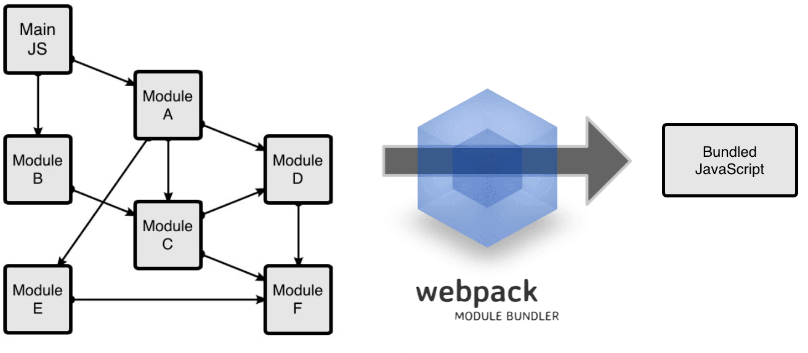
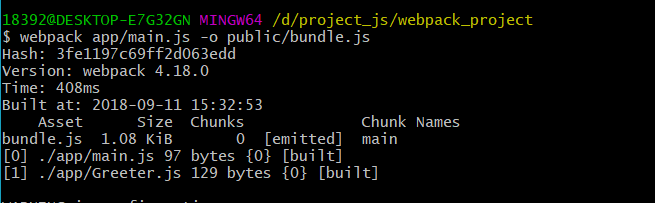

# webpack

### 是什么？

模块打包机，分析项目结构并找到JavaScript模块以及其它一些浏览器不支持的拓展语言（Scss，TypeScript等），并将其转换和打包为合适的格式供浏览器使用。

### 与Gulp/Grunt比较

- Gulp/ Grunt

  这两个是前端优化开发工具，在配置文件中指明对某些文件进行类编译，组合，压缩等任务，之后工具帮你自动完成。

- webpack

  是模块化解决方案，处理速度更快更直接。

  把项目当做一个整体，通过一个给定的主文件（如index.js），从这个文件开始找到项目的所有依赖文件，使用loaders处理它们，最后打包为一个或多个浏览器可识别的js文件。

  

### 安装

1. 安装webpack

```bash
// 全局安装
npm install -g webpack
// 安装到你的项目中
npm install --save-dev webpack
```

2. 新建项目，并通过脚本简单执行一次webpack打包

```bash
// 创建package.json 
npm init
在目录中创建 app/       pbblic/   目录
```

```html
<!-- public/index.html 文件 -->
<!DOCTYPE html>
<html>
<head>
	<meta charset="utf-8">
	<title>Webpack Sample Project</title>
</head>
<body>
	<div id="root"></div>

	<script type="text/javascript" src="bundle.js"></script>

</body>
</html>
```

```javascript
// app/Greeter.js
module.exports = function(){
	var greet = document.createElement('div');
	greet.textContent = "Hi, 阿肆你好！";

	return greet;
}
```

```javascript
//  app/main.js
const greeter = require('./Greeter.js');
document.querySelector('#root').appendChild(greeter());
```

3. **命令行执行 webpack**

```bash
// 打包文件
webpack app/main.js -o public/bundle.js
```




### 通过配置文件 使用webpack

在根目录下创建 webpack.config.js

```js
// ./webpack.config.js
module.exports = {
    entry: __dirname + "/app/main.js",
    output: {
        path: __dirname + "/public",
        filename: "bundle.js"
    }
}


命令行执行： webpack
安装在项目中的： node_modules/.bin/webpack

解释： 
	webpack命令会自动找到文件目录下的webpack.config.js文件并执行。
	__dirname 代表当前文档所在路径，前面两个短横杠！！！
```


### 不想命令行执行 webpack，好

在package.json中配置信息，注意：json文件中不能有注释！！！

在命令行执行 ” npm start “ 即可。

```jso
"scripts":{
    "start": "webpack",
}
```


### loaders

### plugins

